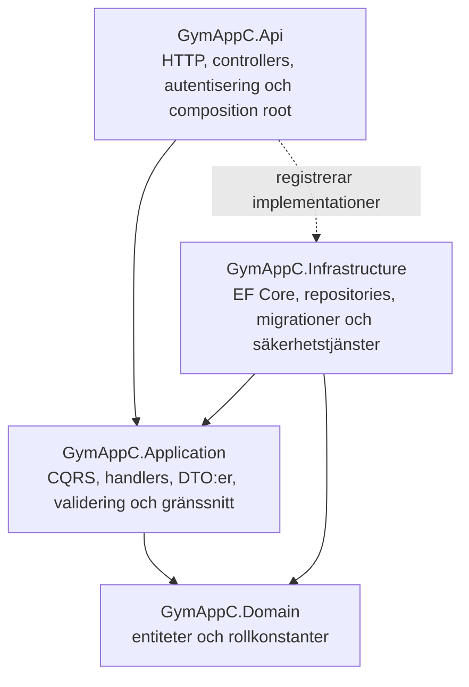

# GymAppC

GymAppC är en fullstackapplikation för registrering och hantering av träningspass. Backend är byggd med ASP.NET Core Web API och följer Clean Architecture med CQRS/MediatR, Repository Pattern, Entity Framework Core, AutoMapper, FluentValidation samt JWT-baserad autentisering och rollstyrning. Frontend är byggd med Next.js och hela lösningen kan köras med Docker Compose.

Projektet är utformat för att uppfylla grundkraven för G och de tekniska tilläggskraven för VG i kursens Clean Architecture-uppgift.

## Teknik

- .NET 9 och ASP.NET Core Web API
- Entity Framework Core 9 och SQL Server 2022/SQL Express
- MediatR med separerade Commands och Queries
- FluentValidation i ett MediatR `ValidationBehavior`
- AutoMapper och DTO:er vid API-gränsen
- JWT Bearer-autentisering och rollerna `Admin` och `User`
- Swagger/OpenAPI med stöd för Bearer-token
- Next.js 16, React 19 och TypeScript
- Docker och Docker Compose
- xUnit-baserade applikationstester

## Arkitektur

Backend består av fyra separata projekt. Beroenden pekar inåt mot Domain och controllers anropar endast Application-lagret via MediatR.



| Lager | Projekt och ansvar |
|---|---|
| API | `backend/GymAppC.Api` – controllers, Swagger, JWT-konfiguration, middleware, CORS och dependency injection. |
| Application | `backend/GymApp.Application` – Commands, Queries, handlers, DTO:er, validators, AutoMapper-profiler och abstraktioner. |
| Domain | `backend/GymAppC.Domain` – entiteterna `User`, `Workout` och `Exercise` samt roller. Lagret har inga projektberoenden. |
| Infrastructure | `backend/GymAppC.Infrastructure` – `AppDbContext`, SQL Server, migrationer, repositories, lösenordshashning, JWT-token och databasinitiering. |

Domänmodellen innehåller relationerna `User` 1–många `Workout` och `Workout` 1–många `Exercise`. Vid borttagning används kaskadradering för de underordnade posterna.

### CQRS- och MediatR-flöde

Ett typiskt API-anrop går genom följande flöde:

1. En controller tar emot HTTP-anropet och skapar ett Command eller en Query.
2. Controllern skickar requesten med MediatR `ISender` och innehåller inga direkta serviceanrop.
3. `ValidationBehavior` kör de FluentValidation-validatorer som hör till requesttypen.
4. En handler utför användningsfallet via ett repository-interface.
5. Infrastructure implementerar dataåtkomsten med Entity Framework Core och `AppDbContext`.
6. AutoMapper omvandlar entiteten till en DTO innan resultatet lämnar Application-lagret.
7. Controllern returnerar rätt HTTP-status och DTO. EF-entiteter exponeras aldrig direkt från API:t.

Commands och Queries är organiserade per feature under `backend/GymApp.Application/Features`. Bland annat finns separata flöden för registrering, login, aktuell användare samt Create, Read, Update och Delete för träningspass.

### Repository Pattern

`IRepository<T>` definieras i Application-lagret och innehåller gemensamma operationer för läsning, skapande, uppdatering, borttagning och sparande. Den generiska `Repository<T>`-implementationen finns i Infrastructure. Specialiserade interfaces och repositories, exempelvis `IWorkoutRepository` och `WorkoutRepository`, kompletterar det generiska kontraktet med domänspecifika frågor.

### DTO:er, AutoMapper och validering

API:t använder separata request- och response-DTO:er. `ApplicationMappingProfile` ligger i Application-lagret och mappar bland annat:

- `User` till `AuthResponseDto` och `CurrentUserDto`
- `Workout` till `WorkoutDto`
- workout-commands till `Workout`

FluentValidation-validatorer finns för autentiseringsflöden, användarfrågor och workout-kommandon/-frågor. De körs centralt av `ValidationBehavior` innan respektive handler. Valideringsfel returneras som HTTP 400 med `ValidationProblemDetails` via den globala exception handlern.

## Autentisering och RBAC

Login returnerar en signerad JWT Bearer-token med claims för användar-id, namn, e-post och roll. Tokenens issuer, audience, livslängd och signatur valideras av API:t.

- Nya användare får rollen `User`.
- Skyddade endpoints kräver en giltig Bearer-token.
- Roller lagras i databasen och inkluderas i JWT-tokenens role claim.
- `DELETE /api/workouts/{id}` kräver rollen `Admin`.
- Lösenord hash- och saltas med PBKDF2-SHA512 innan de sparas.

Skicka token i headern:

```http
Authorization: Bearer <token>
```

### Konfigurationsstyrd Admin-seed

När API:t startar körs migrationerna automatiskt och därefter kan ett Admin-konto skapas från konfiguration. Seedningen körs bara när både e-post och lösenord finns angivna och skapar inte ett nytt konto om e-postadressen redan finns.

Docker Compose läser följande värden från `.env`:

| Variabel | Syfte |
|---|---|
| `ADMIN_SEED_NAME` | Visningsnamn för Admin-kontot. |
| `ADMIN_SEED_EMAIL` | E-post som används vid Admin-login. |
| `ADMIN_SEED_PASSWORD` | Lösenord för det seedade Admin-kontot. |
| `JWT_KEY` | Hemlig nyckel som signerar JWT-token. |
| `MSSQL_SA_PASSWORD` | SQL Server-containerns SA-lösenord. |

För lokal körning utan Compose används motsvarande .NET-konfigurationsnycklar: `AdminSeed__Name`, `AdminSeed__Email`, `AdminSeed__Password` och `Jwt__Key`. Byt samtliga exempelhemligheter innan miljön delas eller publiceras.

## API-endpoints

Basadress vid Docker-körning och i exemplen är `http://localhost:5004`.

| Metod | Route | Behörighet | Resultat |
|---|---|---|---|
| `GET` | `/` | Publik | Enkel statuskontroll för API:t. |
| `POST` | `/api/auth/register` | Publik | Registrerar en användare med rollen `User`. |
| `POST` | `/api/auth/login` | Publik | Returnerar token, e-post, namn och roll. |
| `GET` | `/api/user/me` | Inloggad | Returnerar DTO för aktuell användare. |
| `GET` | `/api/workouts` | Inloggad | Returnerar aktuell användares träningspass. |
| `GET` | `/api/workouts/{id}` | Inloggad | Returnerar ett eget träningspass eller 404. |
| `POST` | `/api/workouts` | Inloggad | Skapar ett träningspass och returnerar 201 med DTO. |
| `PUT` | `/api/workouts/{id}` | Inloggad | Uppdaterar ett eget träningspass och returnerar 204 eller 404. |
| `DELETE` | `/api/workouts/{id}` | Rollen `Admin` | Tar bort valfritt träningspass och returnerar 204 eller 404. |

Färdiga anrop för registrering, login och hela workout-CRUD-flödet finns i `backend/GymAppC.Api/GymAppC.Api.http`. Kör login och kopiera svarets `token` till filens `@token`-variabel innan de skyddade anropen körs. Använd det seedade Admin-kontot för DELETE-anropet.

## Starta med Docker Compose

### Förutsättningar

- Docker Desktop eller motsvarande Docker-miljö
- Lediga portar `1433`, `3000` och `5004`

Kör från repositoryts rot:

```bash
cp .env.example .env
```

Granska `.env` och ersätt exempelvärdena för databas, JWT och Admin-konto. Starta därefter alla tjänster:

```bash
docker compose up --build
```

| Tjänst | Adress |
|---|---|
| Frontend | `http://localhost:3000` |
| Backend API | `http://localhost:5004` |
| Swagger UI | `http://localhost:5004/swagger` |
| SQL Server | `localhost:1433` |

Databascontainern hälsokontrolleras innan API:t startar. API:t kör sedan `Database.MigrateAsync()`, applicerar befintliga EF Core-migrationer och utför Admin-seedningen. Databasdata lagras i Docker-volymen `sql_data`.

Stoppa tjänsterna med:

```bash
docker compose down
```

## Lokal utveckling utan full Docker Compose

### Backend

Förutsättningar:

- .NET SDK 9
- SQL Server eller SQL Express
- En giltig `DefaultConnection` i `backend/GymAppC.Api/appsettings.Development.json` eller miljövariabeln `ConnectionStrings__DefaultConnection`

Återställ beroenden och starta API:t från repositoryts rot:

```bash
dotnet restore backend/GymAppC.Api/GymAppC.Api.sln
dotnet run --project backend/GymAppC.Api/GymAppC.Api.csproj --urls http://localhost:5004
```

API:t applicerar migrationerna automatiskt vid start. Projektet har ett lokalt, versionslåst `dotnet-ef`-verktyg och en design-time factory, så manuell migrationshantering kan köras direkt mot Infrastructure-projektet utan att starta API:t:

```bash
dotnet tool restore

dotnet ef migrations add <MigrationName> \
  --project backend/GymAppC.Infrastructure/GymAppC.Infrastructure.csproj \
  --output-dir Migrations

dotnet ef database update \
  --project backend/GymAppC.Infrastructure/GymAppC.Infrastructure.csproj \
  --connection "<din SQL Server-connection string>"
```

### Frontend

Installera paket och starta utvecklingsservern med API:t på port 5004:

```bash
npm --prefix frontend install
NEXT_PUBLIC_API_URL=http://localhost:5004 \
INTERNAL_API_URL=http://localhost:5004 \
npm --prefix frontend run dev
```

Frontend blir tillgänglig på `http://localhost:3000`.

## Swagger

Swagger UI finns på `http://localhost:5004/swagger`. Alla controllers och endpoints visas där. För att testa skyddade routes:

1. Kör `POST /api/auth/login`.
2. Kopiera token från svaret.
3. Klicka på **Authorize** i Swagger.
4. Klistra in JWT-tokenen i Bearer-fältet.

## Byggning och tester

Kör följande kommandon från repositoryts rot.

Bygg hela backend-lösningen:

```bash
dotnet build backend/GymAppC.Api/GymAppC.Api.sln --configuration Release
```

Kör samtliga backendtester:

```bash
dotnet test backend/GymAppC.Api/GymAppC.Api.sln --configuration Release
```

Kör endast Application-testerna:

```bash
dotnet test backend/GymAppC.Application.Tests/GymAppC.Application.Tests.csproj --configuration Release
```

Verifiera frontend:

```bash
npm --prefix frontend run lint
npm --prefix frontend run build
```

Samma kontroller körs automatiskt av GitHub Actions för varje pull request och push till `main`; arbetsflödet finns i `.github/workflows/ci.yml`.

## GitHub-inställningar före inlämning

Repositoryt är publikt och har en tydlig historik med mergade pull requests. Branch protection är däremot en GitHub-inställning och kan inte aktiveras genom en fil i projektet. Gör därför följande på GitHub innan inlämning:

1. Öppna **Settings → Rules → Rulesets** och skapa en aktiv branch-regel för `main`.
2. Kräv pull request före merge och blockera force-push samt borttagning av branchen.
3. Lägg till statuskontrollerna **Backend** och **Frontend** som obligatoriska efter att CI-arbetsflödet har körts minst en gång.
4. Lägg de här ändringarna på en feature branch och merga dem via en pull request, så att även VG-kompletteringen syns i historiken.

## Kort kravmatris

| Område | G | VG | Implementering i GymAppC |
|---|---|---|---|
| GitHub och struktur | Publikt repo, README, branch protection, tydliga commits och fyra lager. | Tydlig PR-historik. | Publikt repo, fyra projekt, README, CI och 15 mergade PR:er finns. Branch protection behöver aktiveras enligt checklistan ovan. |
| Arkitektur | Fyra lager med rätt beroenden. | Konsekvent arkitektur utan lagerläckage. | Controllers använder MediatR; Domain är oberoende och API-respons består av DTO:er. |
| Modeller och CRUD | Minst två relaterade modeller och full CRUD. | DTO:er via AutoMapper samt validering. | `User`, `Workout` och `Exercise`; full Workout CRUD, AutoMapper och FluentValidation. |
| CQRS och MediatR | Commands och Queries separeras och controllers använder MediatR. | Pipeline Behaviour. | Featurebaserade handlers och generiskt `ValidationBehavior`. |
| Repository och EF Core | Repository, DbContext, SQL Server och migrationer. | Samma krav ska fortsatt vara uppfyllda. | `IRepository<T>`/`Repository<T>`, specialiserade repositories, `AppDbContext` och automatiska migrationer. |
| API-dokumentation | Swagger/Scalar eller Postman och testbara endpoints. | Samma krav ska fortsatt vara uppfyllda. | Swagger med Bearer-stöd samt en komplett `.http`-samling. |
| Autentisering | Inget separat G-krav. | JWT, minst två roller, role claims och rollskyddade endpoints. | JWT Bearer, rollerna `Admin`/`User`, konfigurationsstyrd Admin-seed och Admin-skyddad DELETE. |

## Författare

Martin Andersson<br>
Andersson Webb & System AB

## Repository

[github.com/Andersson76/GymAppC-](https://github.com/Andersson76/GymAppC-)
